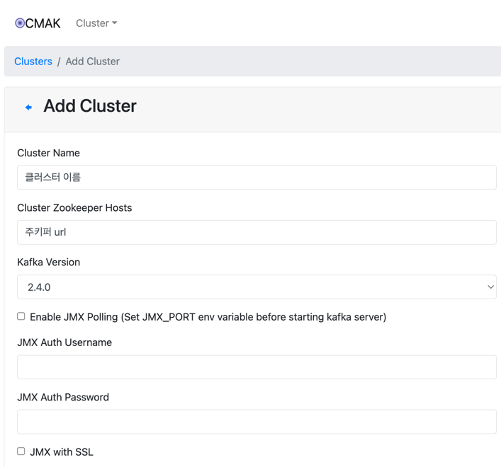

## 카프카 클러스터 생성

- 주키퍼 호스트 : `zookeeper:2181`
- 브로커 개수 2개
- kafka-manager url : `http://localhost:9000`

1. zookeeper 실행하기

`docker-compose -f common.yml -f zookeeper.yml up -d`

2. zookeeper 테스트하기

`echo ruok | nc localhost 2181`

3. kafka 실행하기

`docker-compose -f common.yml -f kafka_cluster.yml up -d`

4. kafka에 토픽 생성하기 - 처음 세팅할 때만 하면 된다.

`docker-compose -f common.yml -f init_kafka.yml up -d`

5. kafka 매니저 포트는 9000 → 클러스터 페이지 들어가보기
6. 수동으로 클러스터 추가하기 및 zookeeper 연결

