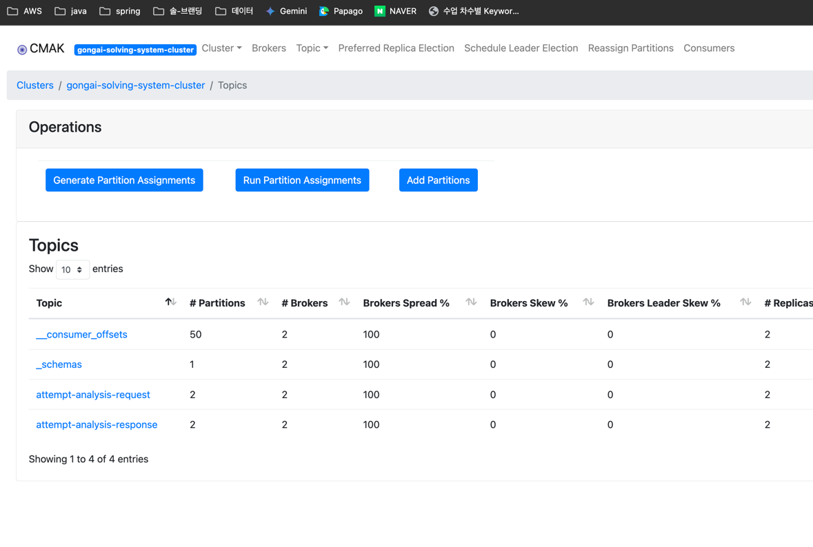

## 수동으로 카프카 클러스터 생성

- kafka-manager url 브라우저에 입력 : `http://localhost:9000` 
- 주키퍼 호스트 등록 : `zookeeper:2181`
- 브로커 개수 2개 확인

## 카프카 클러스터 ec2로 배포하기

0. security group과 subnet 만들기, subnet은 public subnet이라면 상관 없음
    
1. ec2 만들기 `ec2-user-data.sh`를 첨부해서!
   - `ami-045f2d6eeb07ce8c0` 는 aws linux 2023
   - `t3.medium` 부터 충분한 메모리 양 가짐
   - `ec2-cluster-key` 사전에 발급한 pem key
   - `sg-02f510bbcb0a6983c` 앞서 생성한 sg
   - `subnet-05a157c8cae97b9a8` 앞서 생성한 subnet
   - `aws ec2 run-instances --image-id ami-045f2d6eeb07ce8c0 --count 1 --instance-type t3.medium --key-name ec2-cluster-key --security-group-ids sg-02f510bbcb0a6983c --subnet-id subnet-05a157c8cae97b9a8 --user-data file://kafka-cluster-user-data.sh --tag-specifications 'ResourceType=instance,Tags=[{Key=Name,Value=my-kafka-cluster}]'`
2. ec2에 인프라 배포하기
   - 필요한 프로그램 설치됐는지 확인
   - 필요한 이미지 설치
   - docker-compose 실행
   - `sh infra-deploy.sh`

## [미완] 카프카 클러스터 구축 all in one

1. sh 파일 실행, 내부적으로 step by step 과정을 수행
`sh docker-compose/infra-up.sh `
2. `init-kafka`와 `kafka-manager` 를 재실행해야 정상작동하는데 왜 그런지 모르겠습니다... 일단 step by step 하는게 안전함.

## 카프카 클러스터 구축 step by step 

1. zookeeper 실행하기

`docker-compose -f docker-compose/common.yml -f docker-compose/zookeeper.yml up -d`

2. zookeeper 테스트하기

`echo ruok | nc localhost 2181`

3. kafka 실행하기

`docker-compose -f docker-compose/common.yml -f docker-compose/kafka_cluster.yml up -d`
`docker ps -a | grep kafka-broker-1` 브로커 생성 체크!

4. kafka에 토픽 생성하기 - 처음 세팅할 때만 하면 된다.

`docker-compose -f docker-compose/common.yml -f docker-compose/init_kafka.yml up -d`

5. kafka 매니저 포트는 9000 → 클러스터 페이지 들어가보기
6. 수동으로 클러스터 추가하기 및 zookeeper 연결

# AVRO Model 중앙화

- KafkaInfra를 모든 레포지토리에서 subtree로 등록
    - `git remote add kafkaInfra https://github.com/GoungGoung-AI-Math/KafkaInfra.git`
    - `git subtree add --prefix src/main/java/math/ai/my/kafka/infra kafkaInfra main`
- Avro 파일 수정
    - `gradle build generateAvro` 실행
    - 커밋 및 배포
    - 다른 레포지토리는 풀 받아서 사용
- 루트에서 수정하고 푸쉬하는 경우, ex) Problem에서 서브프로젝트 수정 및 푸쉬
  - `git 커밋한 후`
  - `git subtree push --prefix src/main/java/math/ai/my/kafka/infra kafkaInfra main`
- 서브에서 수정하고 푸쉬하는 경우 ex) Problem에서 서브 프로젝트 풀
  - `git subtree pull --prefix src/main/java/math/ai/my/kafka/infra kafkaInfra main`